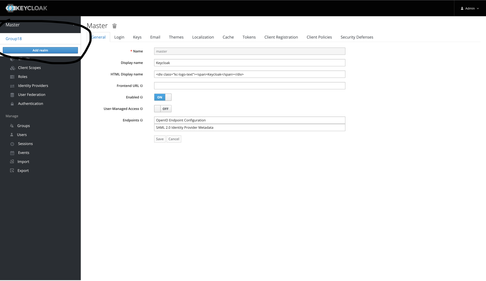
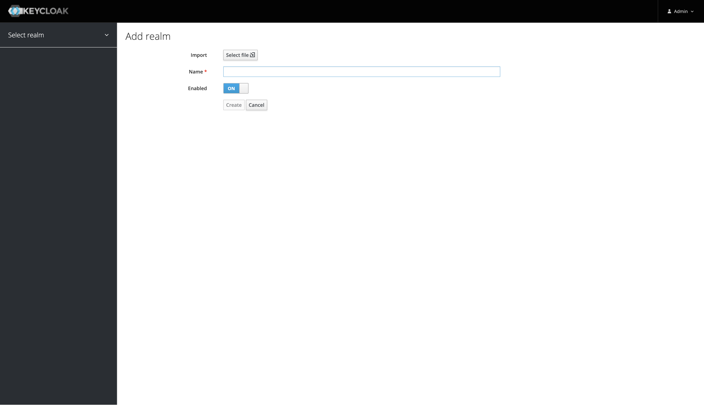

### COM3014 Group 18 CW2

# IN THE REED 

How to run:
 - Backend
   - Run <code>cd backend</code>
   - Run <code>chmod +x build.sh && ./build.sh</code> to build all Java application
   - Run <code>docker-compose up --build</code>
   - For first run only:
     - Once the all services are running. Head over to [The KeyCloak Admin Service](http://localhost:9004)
     - Use the credentials <pre>Username: admin</pre><pre>Password: admin</pre> to log in
     
     - From the image above, click <b>Add Realm</b>
     
     - From the image above, on the import click <b>Select file</b> and upload the file <b>realm-export.json</b> located in the keycloak folder file. Then click create 
     - <b>Voila!</b> The Backend is all done 
 - Frontend
   - Run <code>cd .. && cd client</code> to exit the backend directory to the client directory
   - Run <code>npm install</code> to install all third-party packages
   - Run <code>npm start</code> to run the application
   - Once it's up and running, head-over to [In The Reed](http://localhost:3000) and get your Dream job 💃
